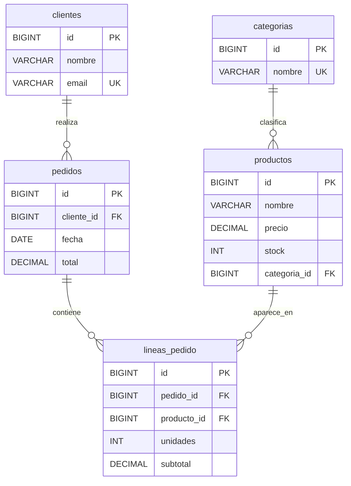

# Ejemplos ejecutables de la UD 9

Estos ejemplos están pensados para acompañar la teoría de acceso a bases de
datos con Kotlin. Todos usan la misma base de datos H2 en fichero, la recrean
con datos semilla al arrancar y se pueden ejecutar de forma independiente.

## Diagrama entidad-relación

El proyecto trabaja sobre una base de datos pequeña de tienda. Este diagrama
resume las entidades y las relaciones que se usan en los ejemplos.



Lectura rápida del modelo:

- Una `categoria` puede tener muchos `productos`.
- Un `cliente` puede realizar muchos `pedidos`.
- Un `pedido` se descompone en varias `lineas_pedido`.
- Cada `linea_pedido` referencia un único `producto`.

## Cómo se ejecutan

1. Entra en la carpeta del proyecto:

```bash
cd .
```

2. Lista las tareas disponibles:

```bash
./gradlew listarEjemplos
```

3. Ejecuta la versión que te interese:

```bash
./gradlew runConexionValida_simple
./gradlew runConexionValida_completo
```

## Mapa de microejemplos

### ConexionValida

- Qué explica: conexión JDBC válida contra H2 y comprobación básica.
- Ejecuta: `runConexionValida_simple` y `runConexionValida_completo`.

### StatementSoloLectura

- Qué explica: uso de `Statement` solo cuando el SQL es fijo y no recibe datos externos.
- Ejecuta: `runStatementSoloLectura_simple` y `runStatementSoloLectura_completo`.

### PreparedSelectParametro

- Qué explica: consulta parametrizada con `PreparedStatement`.
- Ejecuta: `runPreparedSelectParametro_simple` y `runPreparedSelectParametro_completo`.

### SelectBasico

- Qué explica: `SELECT` mínimo con lectura de columnas y salida por consola.
- Ejecuta: `runSelectBasico_simple` y `runSelectBasico_completo`.

### InsertBasico

- Qué explica: inserción simple y versión con servicio y validación.
- Ejecuta: `runInsertBasico_simple` y `runInsertBasico_completo`.

### UpdateBasico

- Qué explica: actualización controlada y comprobación de filas afectadas.
- Ejecuta: `runUpdateBasico_simple` y `runUpdateBasico_completo`.

### DeleteBasico

- Qué explica: borrado parametrizado y lectura posterior de comprobación.
- Ejecuta: `runDeleteBasico_simple` y `runDeleteBasico_completo`.

### MapeoFilaAObjeto

- Qué explica: transformación de una fila SQL a un objeto Kotlin.
- Ejecuta: `runMapeoFilaAObjeto_simple` y `runMapeoFilaAObjeto_completo`.

### MapeoUnoAMuchos

- Qué explica: reconstrucción de una relación uno a muchos desde filas SQL.
- Ejecuta: `runMapeoUnoAMuchos_simple` y `runMapeoUnoAMuchos_completo`.

### GestionSQLException

- Qué explica: tratamiento de `SQLException` y traducción a errores comprensibles.
- Ejecuta: `runGestionSQLException_simple` y `runGestionSQLException_completo`.

### CierreRecursosUse

- Qué explica: cierre correcto de `Connection`, `PreparedStatement` y `ResultSet` con `use`.
- Ejecuta: `runCierreRecursosUse_simple` y `runCierreRecursosUse_completo`.

### TransaccionCommit

- Qué explica: transacción correcta con `commit`.
- Ejecuta: `runTransaccionCommit_simple` y `runTransaccionCommit_completo`.

### TransaccionRollback

- Qué explica: transacción fallida con `rollback`.
- Ejecuta: `runTransaccionRollback_simple` y `runTransaccionRollback_completo`.

### DaoBasico

- Qué explica: interfaz DAO e implementación JDBC mínima.
- Ejecuta: `runDaoBasico_simple` y `runDaoBasico_completo`.

### DaoConServicio

- Qué explica: DAO + servicio de aplicación con separación de responsabilidades.
- Ejecuta: `runDaoConServicio_simple` y `runDaoConServicio_completo`.

### PoolHikariBasico

- Qué explica: uso básico de un pool HikariCP.
- Ejecuta: `runPoolHikariBasico_simple` y `runPoolHikariBasico_completo`.
